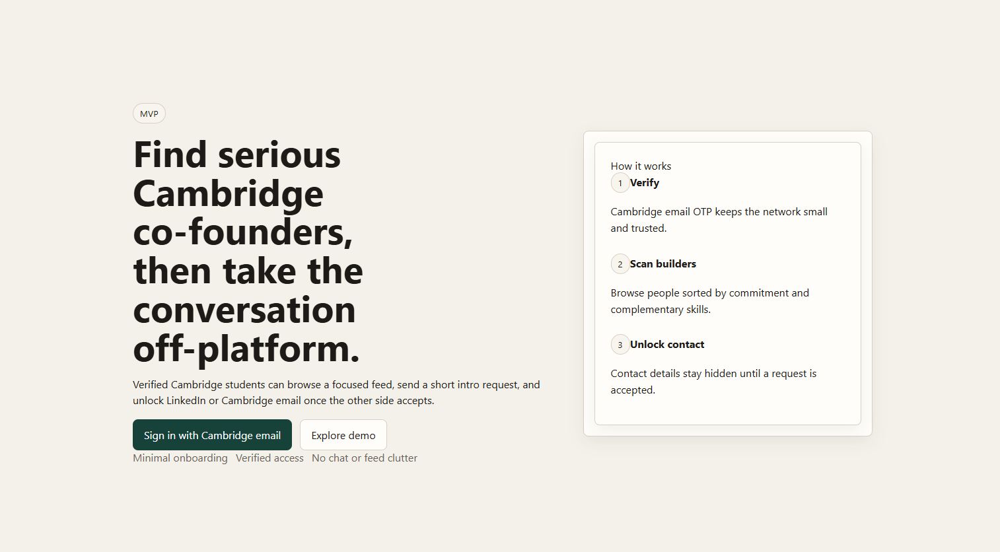

# Cambridge Co-founder Platform

Minimal MVP for verified Cambridge students to discover potential co-founders, send a short intro request, and unlock LinkedIn or Cambridge email once a request is accepted.



## Stack

- Frontend: React SPA served directly by FastAPI static files
- Backend: FastAPI
- Database: SQLite
- Auth: email OTP with a local MVP delivery flow

## Project structure

```text
backend/
  app/
    main.py          FastAPI app and routes
    database.py      SQLite schema, seed data, matching, helpers
    schemas.py       Request models
frontend/
  index.html         SPA entry
  app.jsx            React app
  styles.css         Minimal UI styling
requirements.txt
README.md
```

## What is included

- Cambridge-only email OTP login
- Seeded demo login for product walkthroughs
- Short profile creation and editing
- Deterministic matching feed
- Profile detail with hidden contacts until acceptance
- Connect request flow with pending, accepted, and declined states
- Accepted connections page with unlocked LinkedIn and Cambridge email
- Lightweight daily limits
  - 25 profile detail views per day
  - 10 connect requests per day

## Local run

1. Create and activate a virtual environment.
2. Install dependencies:

```bash
pip install -r requirements.txt
```

3. Start the app:

```bash
uvicorn backend.app.main:app --reload
```

4. Open:

```text
http://127.0.0.1:8000
```

## Login and demo flow

- Cambridge login:
  - Production-ready path: configure SMTP env vars and OTPs will be emailed to the real `@cam.ac.uk` address.
  - Local dev path: leave `OTP_DEV_MODE=true` and the API will still return a visible `dev_code`.
- Demo mode: from the landing page, use `Explore demo`.

## SMTP configuration

You can either set environment variables directly or fill in the root `.env` file.

For Resend SMTP, use:

```text
SMTP_HOST=smtp.resend.com
SMTP_PORT=587
SMTP_USERNAME=resend
SMTP_PASSWORD=
SMTP_FROM_EMAIL=
SMTP_FROM_NAME=Cambridge Co-founder Platform
SMTP_USE_TLS=true
OTP_DEV_MODE=false
```

`SMTP_PASSWORD` should be your Resend API key. According to Resend's SMTP docs, the SMTP host is `smtp.resend.com`, the username is `resend`, and the password is your API key. Source: https://resend.com/docs/send-with-smtp

If SMTP is not configured and `OTP_DEV_MODE=true`, the app falls back to local visible OTP codes for development.

## Notes

- Contact details are only revealed after a connect request is accepted.
- Demo users cannot edit the demo profile, send real requests, or unlock contact details.
- The SQLite database is created automatically at `backend/data/cambridge_cofounder.db` on first run.
- Uploaded profile photos are stored at `backend/uploads/`.
- The React frontend is loaded via browser ESM imports from `esm.sh`, so the local server setup stays Python-only.
